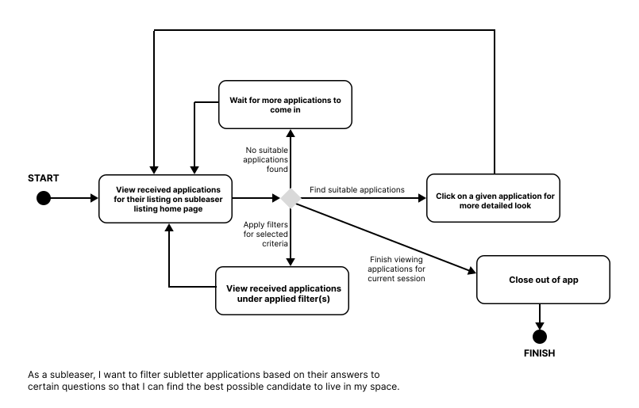

# Specification Phase Exercise

A little exercise to get started with the specification phase of the software development lifecycle. See the [instructions](instructions.md) for more detail.

## Team members

[Brandon Chao](https://github.com/Sciao)

[Shannon Huang](https://github.com/shannonh800)

[Darren Le](https://github.com/DarrenLe20)

[Bruce Wu](https://github.com/bxw201)

## Stakeholders

We interviewed Roger Shui, Mai Le, David Zhuang, Alex Chen, and Alexis Valdez, people with experience subletting and subleasing apartments in the past.

#### Goals
1. To find compatible subletters and subleasers in terms of lifestyle, habits, amenities provided in the space.
2. To filter candidates based on certain criteria such as lease start date, term length, and budget
3. To have a platform that allows for communication between subletter and subleaser
4. To view previous reports on the quality of the space and the amenability of the subletter

#### Frustrations
1. It's difficult to judge the quality of an apartment before living there, even after touring the space.
2. It's hard to know where to start looking for suitable apartments and where to start looking for suitable subletters.
3. There is no centralized place to discover and organize various options for spaces and subletters.
4. For subleasers, there's no way to sort through potential applicants based on their criteria.

## Product Vision Statement

Vimi centralizes and streamlines the discovery, communication, and matching process for an online sublet community.

## User Requirements

1. As a subletter, I want to easily find subletting options so that I can find an appropriate, short term place to live.
2. As a subletter, I want to filter through subletting options based on set criteria so that I can find a place that meets my budget, timeline, and location needs.
3. As a subletter, I want to be able to prioritize and rank my listings based on features that I would like to have so that I can better consider the compatibility of my various subletting options.
4. As a subletter or subleaser, I want to get to know the other party better before I go through with the decision so that I can make sure I am comfortable with who I’m agreeing to sublet from / to.
5. As a subletter, I want to be able to scroll through photos of the sublet option so that I know what it looks like and what to expect in terms of sizing and style.
6. As a subleaser, I want to communicate to potential subletters if I require an upfront deposit or not so that I can make sure the candidates that reach out to me are okay with my payment requirements.
7. As a subleaser, I want to filter subletter applications based on their answers to certain questions so that I can find the best possible candidate to live in my space.
8. As a subletter, I want to know of other people’s legitimate past experiences with a certain subletting option (if people have subletted that place before) so that I know what to expect, in terms of any issues or problems that may reoccur.
9. As a subleaser, I want to see reviews (when possible) of subletters that have sublet through the app before so that I know what to expect, in terms of any bad habits or issues that may come up.
10. As a subleaser, I want to inform all potential subletters about my apartment’s availability so that I can better guarantee my apartment’s rent is covered.
11. As a subleaser, I want to communicate to other potential subletters that my apartment has already been taken so that I can avoid getting bombarded with inquiries even after I find a subletter to take over my place.

## Activity Diagrams

User Story 2:

User Story 7:

